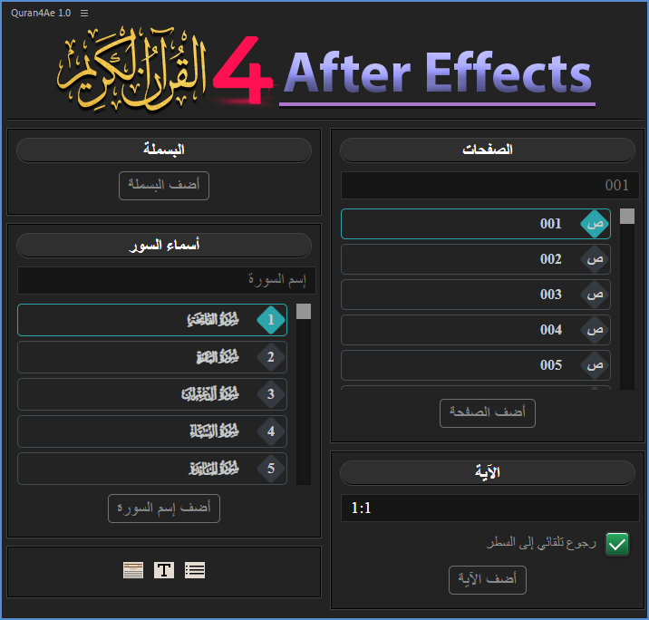

[English](./README-EN.md) | العربية

  
  <h1>مرحبا بكم في مشروع Quran 4 Adobe</h1>

الحمد لله رب العالمين. والصلاة والسلام على أشرف المرسلين، وعلى آله وصحبه ومن والاه ومن تبعهم بإحسان وإهتدى بهديهم وسار على نهجهم إلى يوم الدين.

قمنا وبحمد الله بإنشاء هذه الأداة التي تسمح بإدراج النص القرآني بطريقة سهلة وميسرة على برامج أدوبي، تتيح هذه الأداة إضافة البسملة وإسم السورة والصفحة والآيات القرآنية بسرعة وسهولة إلى مشاريعك، وحاليا الأداة تعمل على أدوبي أفتر إفكتس فقط، ونعمل على تطويرها لكي تعمل على البريمير برو والفوتوشوب في المستقبل، بإذن الله. ... وصلى الله على نبينا محمدﷺ

## أداة إضافية لبرنامج الأفتر إفكتس (Quran4Ae)

  

الأداة عبارة عن إضافة لبرنامج الأفتر افكتس تتيح للمستخدمين إضافة الصفحات والآيات وأسماء السور القرآنية بسهولة إلى مشاريعهم مما يوفر الوقت والجهد.  

### صورة الأداة

  

