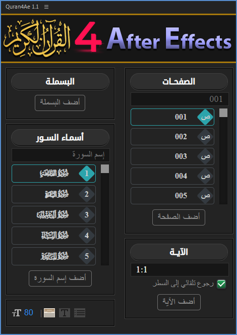
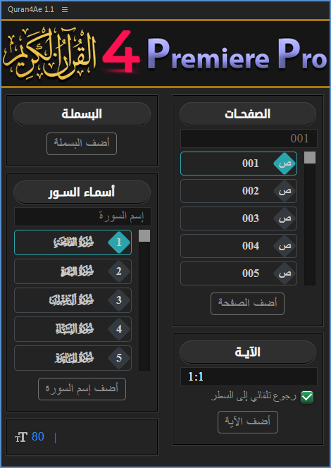
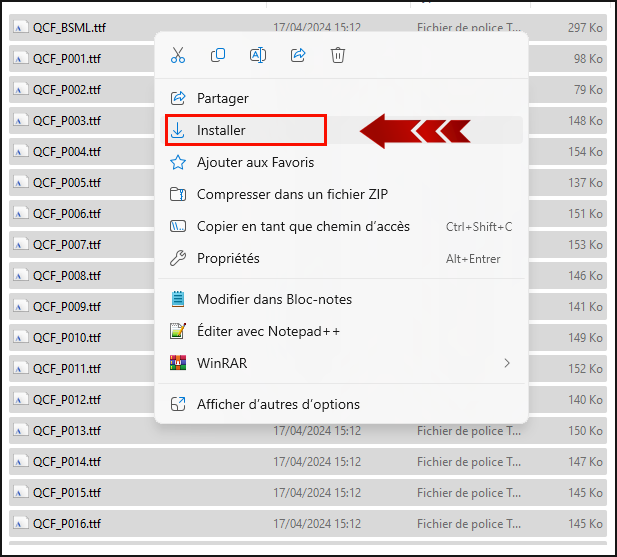

[English](./README-EN.md) | العربية

  
  <h1>مرحبا بكم في مشروع Quran 4 Adobe</h1>

الحمد لله رب العالمين. والصلاة والسلام على أشرف المرسلين، وعلى آله وصحبه ومن والاه ومن تبعهم بإحسان وإهتدى بهديهم وسار على نهجهم إلى يوم الدين.

قمنا وبحمد الله بإنشاء هذه الأداة التي تسمح بإدراج النص القرآني بطريقة سهلة وميسرة على برامج أدوبي، تتيح هذه الأداة إضافة البسملة وإسم السورة والصفحة والآيات القرآنية بسرعة وسهولة إلى مشاريعكم مما يوفر الوقت والجهد، ... وصلى الله على نبينا محمدﷺ

مقطع تعريفي بالأداة:
https://youtu.be/rAthF5uHpZw

## صور الأداة

  
  
  

## طريقة تحميل الأداة وتثبيتها
1- أولا تقوم بتحميل الأداة كما موضح في الصورة.

  

2- ثم تقوم بتفريغ الملف المضغوط إلى مجلد في جهازك.  

3- تقوم بتثبيت جميع الفونتس الموجودة في المجلد fonts  وذلك عن طريق تحديد جميع الفونتس والضغط على تثبيت كما موضح في الصورة.

  

4- ثم تقوم بوضع مجلد الأداة Quran4Adobe 1.2 في المكان المخصص للإضافات وهو : 

C:\Program Files (x86)\Common Files\Adobe\CEP\extensions

5- والآن ما عليك إلا البدأ بإستعمال الأداة.

## البرامج المدعمة

- برنامج أدوبي أفتر إفكتس النسخة 13 فما فوق.
- برنامج أدوبي بريمر برو النسخة 22 فما فوق.
- برنامج أدوبي فوتوشوب النسخة 16 فما فوق.
- برنامج أدوبي إنديزاين النسخة 11 فما فوق.
- برنامج أدوبي إليستريتور النسخة 19 فما فوق (حاليا تحتاج إلى تحديد جهة النص من اليمين إلى اليسار يدويا). 

## الإبلاغ عن الأخطاء وطلب ميزات أخرى

إذا وجدت مشكلة أو كنت ترغب في طلب ميزة جديدة، فما عليك سوى إنشاء issue جديد. تأكد من ملء أكبر قدر ممكن من المعلومات. كل الإقتراحات والتحسينات مرحب بها.
